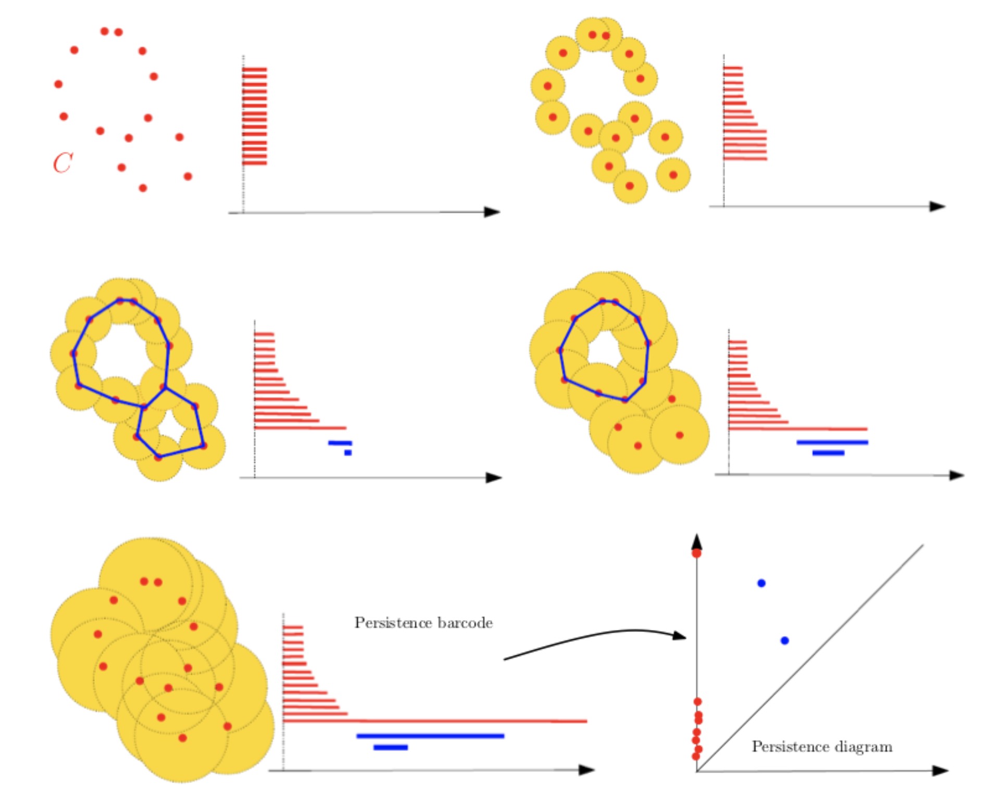

Tutorials for Topological Data Analysis with the Gudhi Library
================

Topological Data Analysis (TDA) is a recent and fast growing field
providing a set of new topological and geometric tools to infer relevant
features for possibly complex data. Here we propose a set of notebooks
for the practice of TDA with the Python Gudhi library together with
popular machine learning and data sciences libraries. See for instance
[this paper](https://arxiv.org/abs/1710.04019) for an introduction to
TDA for data science. The complete list of notebooks can also be found
at the end of this page.

## Install Python Gudhi Library

See the [installation
page](http://gudhi.gforge.inria.fr/python/latest/installation.html) or
if you have conda you can make a [conda
install](https://anaconda.org/conda-forge/gudhi).

## TDA Analysis Pipeline

### 01 - Simplex trees and simpicial complexes

TDA typically aims at extracting topological signatures from a point
cloud in
 or in a general metric space. By studying the topology
of a point cloud, we actually mean studying the topology of the unions
of balls centered at the point cloud, also called *offsets*. However,
non-discrete sets such as offsets, and also continuous mathematical
shapes like curves, surfaces and more generally manifolds, cannot easily
be encoded as finite discrete structures. [Simplicial
complexes](https://en.wikipedia.org/wiki/Simplicial_complex) are
therefore used in computational geometry to approximate such shapes.

A simplicial complex is a set of
[simplices](https://en.wikipedia.org/wiki/Simplex), they can be seen as
higher dimensional generalization of graphs. These are mathematical
objects that are both topological and combinatorial, a property making
them particularly useful for TDA. The challenge here is to define such
structures that are proven to reflect relevant information about the
structure of data and that can be effectively constructed and
manipulated in practice. Below is an exemple of simplicial complex:

A filtration is an increasing sequence of sub-complexes of a simplicial
complex
. It can be seen as ordering the simplices included in
the complex
. Indeed, simpicial complexes often come with a specific
order, as for [Vietoris-Rips
complexes](https://en.wikipedia.org/wiki/Vietoris%E2%80%93Rips_complex),
[Cech complexes](https://en.wikipedia.org/wiki/%C4%8Cech_complex) and
[alpha
complexes](https://en.wikipedia.org/wiki/Alpha_shape#Alpha_complex).

[Notebook: Simplex trees](Tuto-GUDHI-simplex-Trees.ipynb). In Gudhi,
filtered simplicial complexes are encoded through a data structure
called simplex tree. Vertices are represented as integers, edges as
pairs of integers, etc.

[Notebook: Vietoris-Rips complexes and alpha complexes from data
points](Tuto-GUDHI-simplicial-complexes-from-data-points.ipynb). In
practice, the first step of the **TDA Analysis Pipeline** is to define a
filtration of simplicial complexes for some data. This notebook explains
how to build Vietoris-Rips complexes and alpha complexes (represented as
simplex trees) from data points in
, using the simplex tree data structure.

[Notebook: Rips and alpha complexes from pairwise
distance](Tuto-GUDHI-simplicial-complexes-from-distance-matrix.ipynb).
It is also possible to define Rips complexes in general metric spaces
from a matrix of pairwise distances. The definition of the metric on the
data is usually given as an input or guided by the application. It is
however important to notice that the choice of the metric may be
critical to reveal interesting topological and geometric features of the
data. We also give in this last notebook a way to define alpha complexes
from matrix of pairwise distances by first applying a [multidimensional
scaling (MDS)](https://en.wikipedia.org/wiki/Multidimensional_scaling)
transformation on the matrix.

TDA signatures can extracted from point clouds but in many cases in data
sciences the question is to study the topology of the sublevel sets of a
function.

Above is an example for a function defined on a subset of
 but in general the function
 is defined on a subset
of
.

[Notebook: cubical complexes](Tuto-GUDHI-cubical-complexes.ipynb). One
first approach for studying the topology of the sublevel sets of a
function is to define a regular grid on
 and then to define a filtered complex based on this
grid and the function .

### 02 - Persistent homology and persistence diagrams

Homology is a well-known concept in algebraic topology. It provides a
powerful tool to formalize and handle the notion of topological features
of a topological space or of a simplicial complex in an algebraic way.
For any dimension , the
-dimensional *holes* are
represented by a vector space
, whose dimension
is intuitively the number of such independent features. For example, the
-dimensional homology
group  represents
the connected components of the complex, the
-dimensional homology
group  represents
the -dimensional loops,
the -dimensional
homology group 
represents the -dimensional cavities and so on.

Persistent homology is a powerful tool to compute, study and encode
efficiently multiscale topological features of nested families of
simplicial complexes and topological spaces. It encodes the evolution of
the homology groups of the nested complexes across the scales. The
diagram below shows several level sets of the filtration:

[Notebook: persistence diagrams](Tuto-GUDHI-persistence-diagrams.ipynb)
In this notebook we show how to compute barcodes and persistence
diagrams from a filtration defined on the Protein binding dataset. This
tutorial also introduces the bottleneck distance between persistence
diagrams.

### 03 - Representations of persistence and linearization

In this [notebook](Tuto-GUDHI-representations.ipynb), we learn how to
use alternative representations of persistence with the representations
module and finally we see a first example of how to efficiently combine
machine learning and topological data analysis.

This [notebook](Tuto-GUDHI-Expected-persistence-diagrams.ipynb)
illustrates the notion of “Expected Persistence Diagram”, which is a way
to encode the topology of a random process as a deterministic measure.

### 04 - Statistical tools for persistence

For many applications of persistent homology, we observe topological
features close to the diagonal. Since they correspond to topological
structures that die very soon after they appear in the filtration, these
points are generally considered as “topological noise”. Confidence
regions for persistence diagram provide a rigorous framework to this
idea. This [notebook](Tuto-GUDHI-ConfRegions-PersDiag-datapoints.ipynb)
introduces the subsampling approach of [Fasy et al. 2014
AoS](https://projecteuclid.org/download/pdfview_1/euclid.aos/1413810729).

### 05 - A Bayesian Framework for Persistent Homology

C. Oballe and V. Maroulas provide a
[tutorial](https://github.com/coballejr/misc/blob/master/Tuto-GUDHI-bayes-tda.ipynb)
for a Python module that implements the model for Bayesian inference
with persistence diagrams introduced in their
[paper](https://epubs.siam.org/doi/pdf/10.1137/19M1268719).

### 06 - Machine learning and deep learning with TDA

Two libraries related to Gudhi:

  - [ATOL](https://github.com/martinroyer/atol): Automatic
    Topologically-Oriented Learning. See [this
    tutorial](https://github.com/martinroyer/atol/blob/master/demo/atol-demo.ipynb).
  - [Perslay](https://github.com/MathieuCarriere/perslay): A Simple and
    Versatile Neural Network Layer for Persistence Diagrams. See [this
    tutorial](https://github.com/MathieuCarriere/perslay/tree/master/tutorial).

### 07 - Alternative filtrations and robust TDA

This [notebook](Tuto-GUDHI-DTM-filtrations.ipynb) introduces the
distance to measure (DTM) filtration, as defined in [this
paper](https://arxiv.org/abs/1811.04757). This filtration can be used
for robust TDA. The DTM can also be used for robust approximations of
compact sets, see this [notebook](Tuto-GUDHI-kPDTM-kPLM.ipynb).

### 08 - Topological Data Analysis for Time series

### 09 - Cover complexes and the Mapper Algorithm

### 10 - TDA and dimension reduction

### 11 - Inverse problem and optimization with TDA

In this [notebook](Tuto-GUDHI-optimization.ipynb), we will see how Gudhi and
Tensorflow can be combined to perform optimization of persistence diagrams to
solve an inverse problem. This other, less complete
[notebook](Tuto-GUDHI-PyTorch-optimization.ipynb) shows that this kind of
optimization works just as well with PyTorch.

## Complete list of notebooks for TDA

[Simplex trees](Tuto-GUDHI-simplex-Trees.ipynb)

[Vietoris-Rips complexes and alpha complexes from data
points](Tuto-GUDHI-simplicial-complexes-from-data-points.ipynb)

[Visualizing simplicial
complexes](Tuto-GUDHI-alpha-complex-visualization.ipynb)

[Rips and alpha complexes from pairwise
distance](Tuto-GUDHI-simplicial-complexes-from-distance-matrix.ipynb)

[Cubical complexes](Tuto-GUDHI-cubical-complexes.ipynb)

[Persistence diagrams and bottleneck
distance](Tuto-GUDHI-persistence-diagrams.ipynb)

[Representations of persistence](Tuto-GUDHI-representations.ipynb)

[Expected Persistence
Diagram](Tuto-GUDHI-Expected-persistence-diagrams.ipynb)

[Confidence regions for persistence diagrams - data
points](Tuto-GUDHI-ConfRegions-PersDiag-datapoints.ipynb)

[ATOL
tutorial](https://github.com/martinroyer/atol/blob/master/demo/atol-demo.ipynb)

[Perslay
tutorial](https://github.com/MathieuCarriere/perslay/tree/master/tutorial)

[DTM-filtrations](Tuto-GUDHI-DTM-filtrations.ipynb)

[kPDTM-kPLM](Tuto-GUDHI-kPDTM-kPLM.ipynb)

[Inverse problem and optimization with TDA](Tuto-GUDHI-optimization.ipynb)

[PyTorch differentiation of diagrams](Tuto-GUDHI-PyTorch-optimization.ipynb)

Contact : <bertrand.michel@ec-nantes.fr>
