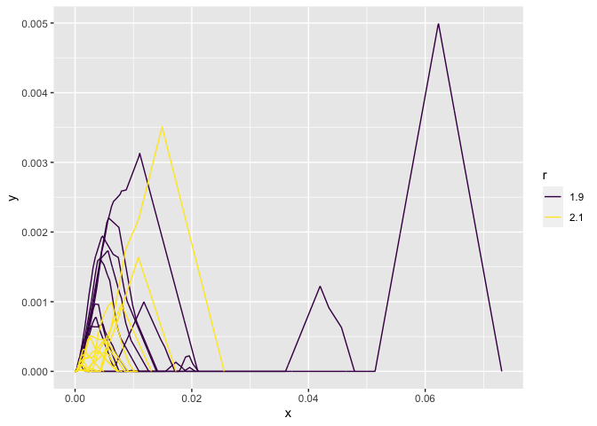

Using up-to-date Gudhi library in R
================
Aymeric Stamm
2022-06-13

-   <a href="#initial-setup" id="toc-initial-setup">Initial setup</a>
-   <a href="#full-example" id="toc-full-example">Full example</a>
    -   <a href="#data-model" id="toc-data-model">Data model</a>
    -   <a href="#sample-generation" id="toc-sample-generation">Sample
        generation</a>

## Initial setup

Let us start by loading the
[**reticulate**](https://rstudio.github.io/reticulate/) package into the
environment, along with the [tidyverse](https://www.tidyverse.org),
which is a suite of useful packages for data science:

``` r
library(reticulate)
# install.packages("tidyverse")
library(tidyverse)
```

    ── Attaching packages ─────────────────────────────────────── tidyverse 1.3.1 ──

    ✔ ggplot2 3.3.6     ✔ purrr   0.3.4
    ✔ tibble  3.1.7     ✔ dplyr   1.0.9
    ✔ tidyr   1.2.0     ✔ stringr 1.4.0
    ✔ readr   2.1.2     ✔ forcats 0.5.1

    ── Conflicts ────────────────────────────────────────── tidyverse_conflicts() ──
    ✖ dplyr::filter() masks stats::filter()
    ✖ dplyr::lag()    masks stats::lag()

Let us inform the R session that we want to use the virtual environment
`r-reticulate` where we installed all the required Python packages (see
`README` at the root of the project). This is done with:

``` r
use_condaenv("r-reticulate")
```

    Warning: The request to `use_python("/Users/stamm-a/Library/r-miniconda/envs/
    r-reticulate/bin/python")` will be ignored because the environment variable
    RETICULATE_PYTHON is set to "/Users/stamm-a/Library/r-miniconda/envs/r-
    reticulate/bin/python3.9"

If you want to check your Python configuration, you can do:

``` r
py_config()
```

    python:         /Users/stamm-a/Library/r-miniconda/envs/r-reticulate/bin/python3.9
    libpython:      /Users/stamm-a/Library/r-miniconda/envs/r-reticulate/lib/libpython3.9.dylib
    pythonhome:     /Users/stamm-a/Library/r-miniconda/envs/r-reticulate:/Users/stamm-a/Library/r-miniconda/envs/r-reticulate
    version:        3.9.6 | packaged by conda-forge | (default, Jul 11 2021, 03:36:15)  [Clang 11.1.0 ]
    numpy:          /Users/stamm-a/Library/r-miniconda/envs/r-reticulate/lib/python3.9/site-packages/numpy
    numpy_version:  1.22.4

    NOTE: Python version was forced by RETICULATE_PYTHON

You can now create chunks of Python code that will be correctly
interpreted when knitting your document into an HTML file. Let us make a
first Python chunk of code to import **numpy** and **gudhi**:

``` python
import numpy as np
import gudhi as gd
import gudhi.representations
```

## Full example

### Data model

First, we will generate persistence diagrams with orbits of dynamical
systems. This data set is very common in TDA. We use the following
system, which depends on a parameter $r > 0$:

$$
\begin{cases}
x_{n+1} = x_n + r y_n (1 - y_n) \mbox{ mod } 1 \\
y_{n+1} = y_n + r x_{n+1} (1 - x_{n+1}) \mbox{ mod } 1
\end{cases}
$$

Let’s first see what the point cloud looks like for a given choice of
$r$.

We first define a **Python** function to compute a single point cloud
according to the above orbit model and then use the
[**Gudhi**](https://gudhi.inria.fr) library to compute the persistence
diagrams from its alpha complex and turn it into its silhouette
representation. This can be achieved by a function that looks like:

``` python
def orbit_silhouette(num_pts = 1000, resolution = 1000, r = 2):
  X = np.empty([num_pts, 2])
  x, y = np.random.uniform(), np.random.uniform()
  for i in range(num_pts):
    X[i, :] = [x, y]
    x = (X[i, 0] + r * X[i, 1] * (1 - X[i, 1])) % 1.
    y = (X[i, 1] + r * x * (1 - x)) % 1.
  acX = gd.AlphaComplex(points = X).create_simplex_tree()
  dgmX = acX.persistence()
  SH = gd.representations.Silhouette(
    resolution = resolution, 
    weight = lambda x: np.power(x[1] - x[0], 1)
  )
  sh = SH.fit_transform([acX.persistence_intervals_in_dimension(1)])
  return([np.linspace(SH.sample_range[0], SH.sample_range[1], resolution), sh[0]])
```

This function returns a Python list of size 2. The first element is the
abscissa grid and the second element is the silhouette value on the
grid.

Python lists are automatically converted into atomic vectors in R.
Automatic conversions of data types between R and Python languages are
implemented in reticulate: see
<https://rstudio.github.io/reticulate/#type-conversions>.

### Sample generation

Now we can go back in **R** to use this **Python** function and generate
two samples of silhouette profiles. To access any Python object
`my_py_object` created in a previous chunk from an R chunk, use
`py$my_py_object`. Following this logic, the Python function
`orbit_silhouette()` created in the above Python chunk is accessible
from any subsequent R chunk as `py$orbit_silhouette()`:

``` r
n1 <- 10
n2 <- 10
x1 <- replicate(n1, py$orbit_silhouette(r = 1.9), simplify = FALSE)
x2 <- replicate(n2, py$orbit_silhouette(r = 2.1), simplify = FALSE)

t1 <- x1 |> map(1) |> map(~ c(0, .x))
x1 <- x1 |> map(2) |> map(~ c(0, .x))
t2 <- x2 |> map(1) |> map(~ c(0, .x))
x2 <- x2 |> map(2) |> map(~ c(0, .x))

df <- bind_rows(
  tibble(id = 1:n1, x = t1, y = x1) |> 
    unnest(cols = c(x, y)) |> 
    mutate(r = "1.9"), 
  tibble(id = 1:n2, x = t2, y = x2) |> 
    unnest(cols = c(x, y)) |> 
    mutate(r = "2.1")
) |> 
  mutate(
    id = as_factor(id), 
    r = as_factor(r)
  )
df |> 
  ggplot(aes(x, y, color = r, group = interaction(id, r))) +
  geom_line() + 
  scale_color_viridis_d()
```


